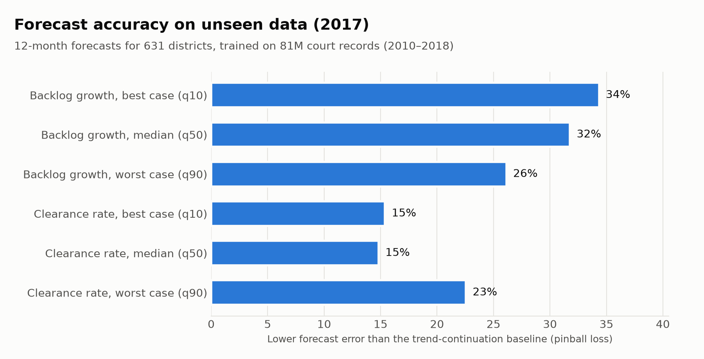
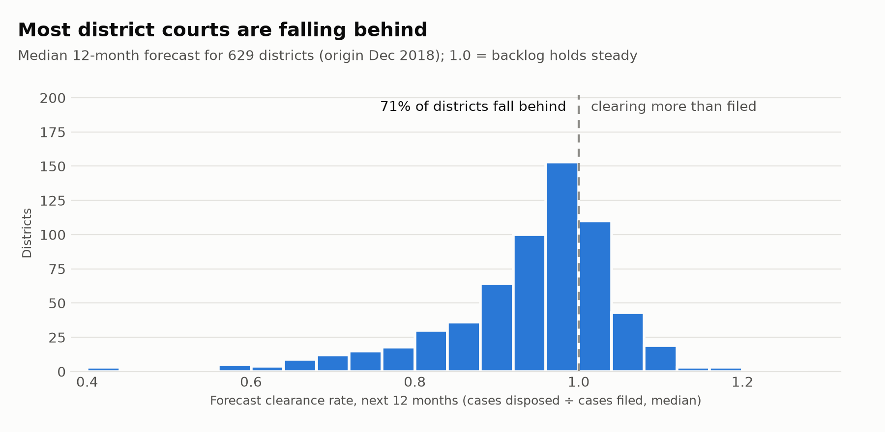
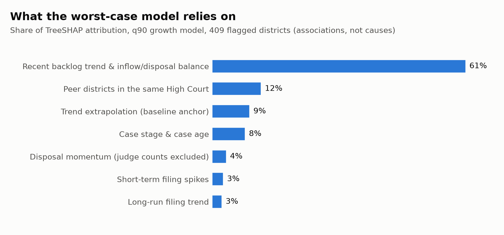

# District court pendency forecasting (DDL eCourts × NJDG)

## Results on real data (81M court cases, 2010–2018)

Trained on Development Data Lab's eCourts dataset: 80.9 million district-court cases across 632 districts.
Full write-up and limitations: [`results/ddl_2010_2018/RESULTS.md`](results/ddl_2010_2018/RESULTS.md).
Trained model: [`models/ddl_2010_2018/`](models/ddl_2010_2018/).

**Graded against reality:** forecasts for 2019, committed before any 2019 data was looked at, were scored against
official state-wise figures (Lok Sabha USQ 1838, Supreme Court / NJDG). They had 30% less error than trend
continuation on backlog growth and 24% less on clearance ratio, across 27 states holding 99.8% of cases.






The forecasts cover Dec 2018 → Dec 2019 because the public data ends in 2018. They were committed before any
2019 data was looked at, so they can be graded against what actually happened (`grade_2019.py`, using NJDG
district data). Pre-2010 cases are not in the data; the judge-requirement levers are withheld because the
judge effect is not identified from DDL alone (see RESULTS.md). Data licences: [`DATA_LICENSE.md`](DATA_LICENSE.md).

### Grading the 2019 forecast (run locally; Dataful data is paid and stays off GitHub)
```
pip install pandas pyarrow openpyxl
python court_pendency/prepare_dataful.py --src ~/Downloads/dataful --out court_pendency/dataful   # 21265 + 21282
python court_pendency/grade_2019.py --dataful court_pendency/dataful \
    --district-key court_pendency/ddl_compact/district_key.csv
# review results/ddl_2010_2018/grading_2019/crosswalk_review.csv; add unmatched districts to
# court_pendency/crosswalk_overrides.csv (state, district_as_per_source, district_id) and re-run.
# Commit only results/ddl_2010_2018/grading_2019/ (aggregate scores + names), never court_pendency/dataful/.
```

Direct multi-horizon (12/24/36-month) quantile forecasts (q10/q50/q90) of district-level backlog growth and
clearance ratio, benchmarked against trend continuation and a linear quantile regression, with TreeSHAP
attribution and disposal elasticities (fixed-effects OLS and a shift-share IV). The elasticities are turned into
bench, hearing-cadence and surge-capacity levers only when the judge effect is identified.

```
pip install -r requirements.txt
python pendency_forecast.py --synthetic --out outputs/            # end-to-end on DDL/NJDG-schema synthetic data
python pendency_forecast.py --ddl-compact ddl_compact --ddl-only --out outputs/   # real DDL data, no NJDG
python make_charts.py --results outputs/                          # PNG charts
python pendency_forecast.py \
  --ddl-csv-glob 'ddl/cases/cases_*.csv' --ddl-parquet data/ddl_parquet \
  --ddl-judges ddl/judges_clean.csv --njdg data/njdg_monthly.csv \
  --edges data/district_edges.csv --out outputs/
```

## Using the real DDL data when it's too big to upload

The ~5 GB DDL download is shrunk on your own computer into a small package of aggregated counts (tens of MB):

```
# 1. Get the code (or download the three files compress_ddl.py, taxonomy.py from GitHub)
git clone https://github.com/Arnavthemighty/areudumb && cd areudumb
git checkout claude/hopeful-wright-qibytw
pip install pandas pyarrow

# 2. Check what it finds, then shrink (Windows: use "C:\path\to\folder")
python court_pendency/compress_ddl.py --src "/path/to/unzipped/ddl" --list-only
python court_pendency/compress_ddl.py --src "/path/to/unzipped/ddl" --out court_pendency/ddl_compact

# 3. Send it: commit court_pendency/ddl_compact/ and push, or upload the folder's files on GitHub
#    (Add file -> Upload files); every file is kept under 24 MB.
```

Then train with `python pendency_forecast.py --ddl-compact ddl_compact --njdg <njdg_monthly.csv> --out outputs/`.
Only aggregated counts leave your computer, no case-level rows or names.

Inputs
- DDL judicial data: per-year case CSVs + judges file; column map in `DDL_CASE_COLS` / `DDL_JUDGE_COLS`
  (check it against the release README before running on real data).
- NJDG: one row per district-month; required columns in `NJDG_REQUIRED`, optional columns in `NJDG_OPTIONAL`.
  NJDG publishes snapshots, not history, so this file has to be built by archiving snapshots month by month.
- Edges: undirected district adjacency (`src_state,src_dist,dst_state,dst_dist`), e.g. Queen contiguity on SHRUG pc11 polygons.

Outputs: `panel_features.parquet`, `validation_metrics.csv` (per validation year and pooled; LightGBM vs the
trend baseline and a linear quantile regression, with 95% High-Court bootstrap ranges), `forecasts.csv` (model,
linear and trend forecasts), `origin_state.csv`, `hearing_at_scrape.csv` (descriptive only), `shap_q90_flagged.csv`,
`drivers_flagged.csv`, `elasticities.csv` (FE-OLS, shift-share IV, first-stage F), and `policy_levers.csv` only
when the judge elasticity is identified (first-stage F >= 10, plausible value).
