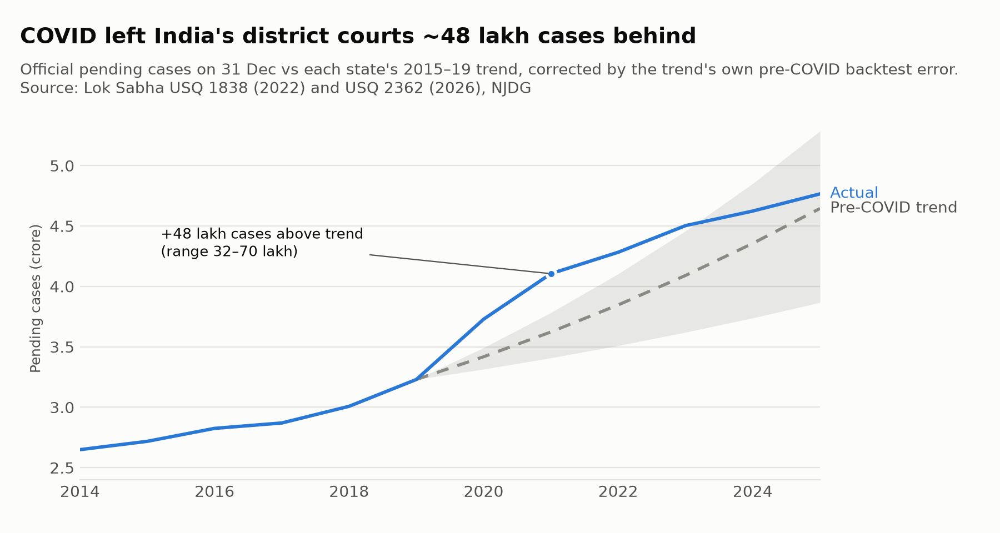
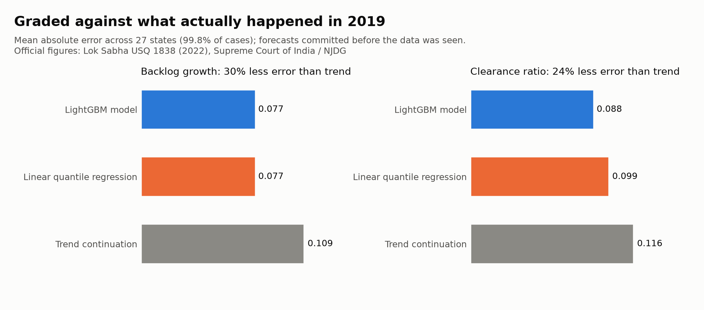

# CourtSight

**Forecasting the backlog of India's district courts, and checking the forecasts against what actually happened.**

India's district and subordinate courts held **4.77 crore (47.7 million) pending cases** on 31 December 2025. CourtSight
models where that backlog comes from and where it is heading, using 80.9 million individual court records and the
official figures the Ministry of Law & Justice reports to Parliament. Every claim below is reproducible from this repo,
and the weaker results are reported alongside the strong ones.

## Results

### 1. COVID left India's district courts about 48 lakh cases behind


At the end of 2021, the courts held **48 lakh (4.8 million) more pending cases** than each state's pre-pandemic trend
implies (range 32–70 lakh). That is about **one in every eight pending cases**. The trend is corrected by its own
error in pre-COVID backtests, and the range spans that observed error rather than a model of it. By 2024 the gap can
no longer be told apart from the trend.

The official flows show where it came from. In 2020 the courts disposed of **92 lakh cases, less than half the
2017–19 average of 1.91 crore**. Over 2020–21 they disposed of about **1.2 crore fewer cases than normal**, while new
filings fell by about 60 lakh, which offset half the shortfall. Measured this second way against a flat 2017–19
baseline, the net addition is about 61 lakh. That is consistent with the trend method, which also allows for growth.
Code: [`covid_excess.py`](covid_excess.py); results: [`results/covid_excess/`](results/covid_excess/).

### 2. A forecast for 31 December 2026, locked before the outcome exists
**4.93 crore pending cases** nationally (range 4.78–5.07 crore), with a forecast for every state. Five methods were
backtested on every non-COVID year. The selection rule was written into the code before the backtest ran, and the
scoring rule is committed in [`PROTOCOL_2026.md`](results/forecast_2026/PROTOCOL_2026.md). When the Ministry publishes
the 31.12.2026 figures, [`grade_2026.py`](grade_2026.py) scores the forecast in one command. Until then the result is
open. A review after locking found weaknesses, notably that the state ranges are too narrow for small states and
too wide for large ones. They are recorded in an addendum rather than fixed, and a test fails if the locked files
change.

### 3. At today's pace, India's backlog is never cleared
Over 2023–2025 the national backlog grew by about **13 lakh cases a year**. Clearing it within ten years would take
about **61 lakh extra disposals every year**, roughly a third more than the courts disposed of in 2021. 25 of 34
states and union territories are still growing; Delhi (+14.5% a year) and West Bengal (+14%) fastest. Kerala, where
the backlog is falling, would clear it in about 33 years. Code: [`backlog_clock.py`](backlog_clock.py); every state:
[`results/backlog_clock/states.csv`](results/backlog_clock/states.csv).

### 4. How long a case takes, in every district
Survival analysis on all 80.9 million cases (cases still pending when the data was collected count as undecided,
using each state's own collection date). A civil case filed in 2010–2018 took a median **21 months** to decide and a
criminal case **10 months**, but about **1 in 5 of either was still pending after 5 years**. Across districts the
median ranges from under a month to almost 9 years. By case type: bail applications are decided almost at once (median **0 months**, under 1% pending after
a year), divorce and family cases take a median **13 months**, motor-accident claims and sessions trials about
**21–22 months**, cheque-bounce (NI Act s.138) cases **23 months**, and **ordinary civil suits 32 months, with
29% still pending after 5 years**. Results for 626 districts × 10 case types, with district names:
[`results/time_to_decision/by_district_case_type.csv`](results/time_to_decision/by_district_case_type.csv).

### 5. What a change of judge costs a courtroom: no reliable estimate (a negative result)
[`judge_transfer.py`](judge_transfer.py) compares courtroom disposals around 11,142 judge handovers (447 districts)
with courtrooms in the same district that had no change. On synthetic data it recovers a planted 30% drop. On the
real data it finds disposals about **10% lower for a year** after a handover, **but a placebo test fails**: moving
every handover 18 or 30 months *earlier*, to dates when no judge changed, gives almost the same drop (−8.5% and
−7.0%), and the decline is already visible before the true date. So the design is picking up courtrooms that were
slowing down anyway, not the cost of the change itself. Only 42% of judge-months also show disposals under the
same court number, so courtroom matching is weak. We report this as no reliable estimate rather than publish the
−10%. Details: [`results/judge_transfer/summary.json`](results/judge_transfer/summary.json).

### 6. A district-level model on 80.9 million cases, graded honestly
- **Model:** quantile models (best case, median, worst case) of each district's 12-month backlog growth and clearance
  ratio (disposals ÷ filings). They are built from every case's filing and decision dates in Development Data Lab's
  eCourts data: 632 districts, 2010–2018.
- **Tested on years it never saw (2016 and 2017):** the median forecasts beat the strongest simple forecast by
  **12–25%**. The range comes from resampling whole High Courts.
- **Graded against official 2019 figures** (forecasts saved before the outcome was looked at): at state level the model
  **matches simple forecasts built from the official series but does not beat them**.
- **The model first looked 30% better.** That was against a trend benchmark that flattered it; it was caught and
  corrected, and both comparisons are published ([`RESULTS.md`](results/ddl_2010_2018/RESULTS.md)).



## What the project does not claim
- **No "judges needed" numbers.** The data cannot separate the effect of adding judges from where judges are posted.
  A recruitment-based instrument was tried and is too weak (first-stage F = 6.2), so those numbers are withheld.
- **A simple model nearly matches the gradient-boosted one.** A 7-variable linear model ties it on backlog growth.
  The gain comes from how the problem is set up, not from the algorithm.
- **The DDL data starts in 2010.** Older cases are invisible to the district model, which biases its clearance ratios
  downward. This is stated wherever it matters.

## Repository map
| Path | What it is |
|---|---|
| `official_series.py` | Official state-wise pending cases 2014–2025, transcribed from Parliament answers (checked against the printed totals) |
| `covid_excess.py` | COVID excess-backlog estimate with backtest-calibrated ranges |
| `forecast_2026.py`, `grade_2026.py`, `results/forecast_2026/` | The locked 2026 forecast, its protocol and its grader |
| `pendency_forecast.py` | District pipeline: stock-flow reconstruction, features, quantile models, validation, attribution, elasticities |
| `compress_ddl.py`, `ddl_compact/` | Shrinks the 5 GB DDL download to aggregated counts on your own computer |
| `grade_state_2019.py`, `naive_benchmarks.py` | 2019 grading and the strict benchmarks |
| `backlog_clock.py`, `time_to_decision.py`, `judge_transfer.py` | Clearance clock, time to decision, judge handover study |
| `results/ddl_2010_2018/` | Model outputs, metrics, charts and `RESULTS.md` |
| `sources/` | The official documents used, with URLs and SHA-256 fingerprints |
| `tests/` | Transcription checks against printed totals, locked-forecast integrity, grading arithmetic |

## Run it
```
pip install -r requirements.txt
python3 covid_excess.py                     # COVID estimate (official data is built in)
python3 forecast_2026.py                    # rebuilds the 2026 forecast and its backtest
python3 pendency_forecast.py --ddl-compact ddl_compact --ddl-only --out outputs/   # district model (~5 min)
python3 make_charts.py                      # charts
python3 tests/test_official_series.py && python3 tests/test_locked_forecast.py && python3 tests/test_grade_2019.py
```

## Data quality notes
- **Kerala, 2016:** the official disposals table prints 1,19,93,996, about ten times the state's other years, and
  the printed national total includes it. It is treated as missing here, not corrected.
- **"2022" in the 2022 answer** is a mid-December figure, not 31 December.
- **Some official series jump** in ways court activity cannot explain (for example, Tripura's backlog falls 75% in
  2019). These are reported, and results are shown with and without them.

## Data and licences
- **Case records:** Development Data Lab, Indian judicial data (eCourts, 2010–2018), CC BY-NC-SA 4.0. Derived files
  here carry the same licence; see [`DATA_LICENSE.md`](DATA_LICENSE.md).
- **Official pendency:** Lok Sabha Unstarred Questions 1838 (16.12.2022) and 2362 (13.02.2026), Ministry of Law &
  Justice; figures from NJDG and the Supreme Court of India.
